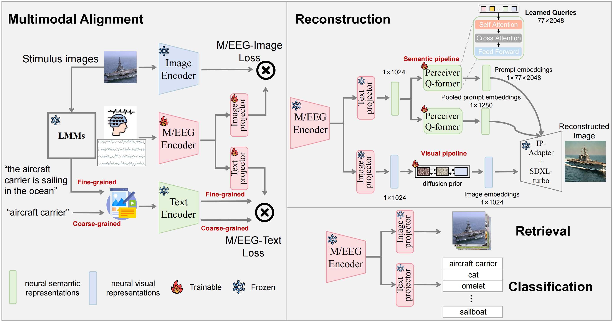

<h1 align="center">UMind: A Unified Multitask Network for Zero-Shot M/EEG Visual Decoding</h1>

[](https://arxiv.org/abs/2509.14772)

## Abstract

- **Unified Multitask Framework**: We introduce a zero-shot M/EEG-based multitask model for retrieval, classification, and reconstruction, surpassing single-task methods through joint optimization and mutual feature reinforcement.
- **Multimodal Alignment Strategy**: Our approach integrates M/EEG, images, and text, using dual-granularity text fusion to enhance neural-visual and semantic representation learning.
- **Dual-Conditional Diffusion Model**: We separately extract neural visual and semantic features and employ them as dual conditions for guiding image generation, ensuring more comprehensive and accurate reconstruction.



<div align="center">The framework of UMind.</div>


<div align="center">The reconstruction cases based on EEG.</div>

## Datasets
1. [Things-EEG2](https://www.sciencedirect.com/science/article/pii/S1053811922008758?via%3Dihub)
2. [Things-MEG](https://elifesciences.org/articles/82580) 

## M/EEG pre-processing
### Script path
- `./EEG-preprocessing/`
- `./MEG-preprocessing/`
### Data path 
- raw coarse-grained text data: `./data/class_names.txt`
- raw fine-grained text data: `./data/class_names.txt`
- proprocessed eeg data: `./Data/Things-EEG2/Preprocessed_data_250Hz/`
- proprocessed image and text data: `ViT-H-14_detail_class_features_train.pt`
## Visual Decoding
### Environment setup

```
pip install -r requirements.txt
```


### Multimodal Alignment Pretraining

```
python EEG_image_retrieval_classification.py
```


### Visual Reconstruction

1. Semantic guidance:

```
python text_condition.py
python text_pool_condition.py
```

2. Visual guidance:

```
python image_condition.py
```

3. EEG-based visual reconstruction

```
python EEG_image_generation.py
```

4. Reconstruction metrics computation

```
python recon_metrics.py
```

## Citation

Hope this code is helpful. I would appreciate you citing us in your paper. 😊
```
@article{xu2025umind,
  title={{UMind}: {A} {Unified} {Multitask} {Network} for {Zero-Shot} {M/EEG} {Visual} {Decoding},
  author={Xu, Chengjian and Song, Yonghao and Liao, Zelin and Zhang, Haochuan and Wang, Qiong and Zheng, Qingqing},
  journal={arXiv preprint arXiv:2509.14772},
  year={2025}
}
```
