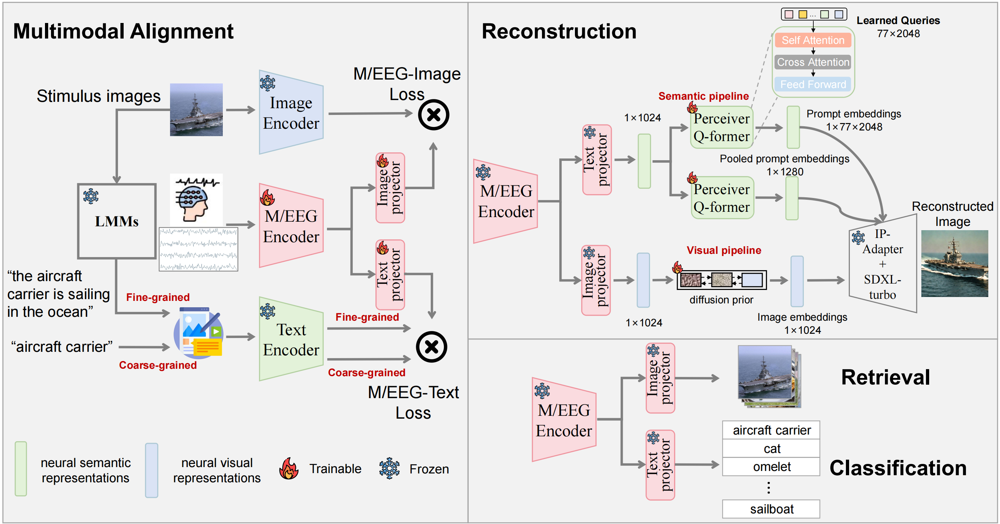
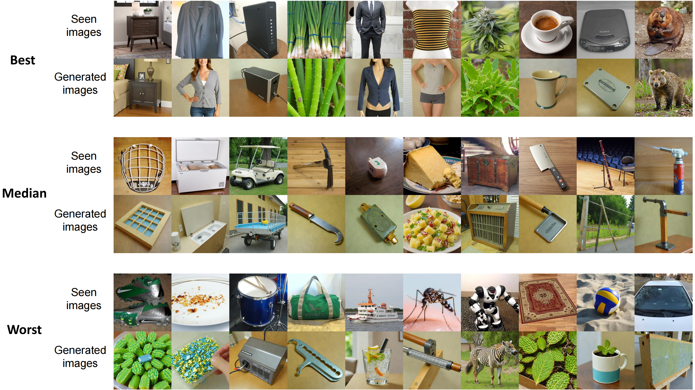

<h1 align="center">UMind: A Unified Multitask Network for Zero-Shot M/EEG Visual Decoding</h1>

<p align="center">
  Official implementation of <strong>UMind</strong>: a unified multitask framework for zero-shot M/EEG-based visual retrieval, classification, and reconstruction.
</p>

<p align="center">
  📄 <a href="https://arxiv.org/abs/2509.14772">Paper</a>
</p>

## Abstract

UMind is a unified multitask network for zero-shot M/EEG visual decoding. It provides a coherent framework for retrieval, classification, and reconstruction by aligning neural signals with pretrained visual and text representations.

- **Unified multitask framework**: UMind supports zero-shot M/EEG-based retrieval, classification, and image reconstruction within a unified multimodal framework, offering a consistent interface for multiple visual decoding tasks.
- **Multimodal alignment strategy**: UMind aligns M/EEG signals with image and text representations, and leverages dual-granularity textual information to model both neural-visual and neural-semantic correspondence.
- **Dual-conditional diffusion reconstruction**: Neural visual and semantic features are separately extracted and used as dual conditions for diffusion-based image generation, supporting faithful and semantically consistent reconstruction.



<div align="center">Overall framework of UMind.</div>



<div align="center">EEG-based visual reconstruction examples.</div>

## Datasets

UMind is evaluated on the following public M/EEG visual decoding benchmarks:

1. [THINGS-EEG2](https://osf.io/b83fj/overview)
2. [THINGS-MEG](https://openneuro.org/datasets/ds004212/versions/2.0.0)

## Environment Setup

```bash
conda create -n UMind python=3.10 -y
conda activate UMind
pip install -r requirements.txt
```

## Multimodal Data Preparation

### M/EEG Preprocessing

Preprocessing scripts are provided for EEG and MEG data:

- `./EEG-preprocessing/`
- `./MEG-preprocessing/`

### Image and Text Preparation

Generate fine-grained image captions:

```bash
python detail_text_generation.py
```

Extract image and text features using the pretrained multimodal encoder:

```bash
python img_text_feature_load.py
```

Extract SDXL prompt embeddings and pooled prompt embeddings for visual reconstruction:

```bash
python text_features_load_SDXL.py
```

### Data Paths

Please organize the processed data and multimodal features as follows:

- Raw coarse-grained text labels: `./data/class_names.txt`
- Raw fine-grained text captions: `./data/detail_caption.txt`
- Preprocessed EEG data: `./data/Things-EEG2/Preprocessed_data_250Hz/`
- Preprocessed image-text features: `ViT-H-14_detail_class_features.pt`
- SDXL prompt embeddings: `./data/SDXL-text-encoder_prompt_embeds.pt`

## Visual Decoding

### Multimodal Alignment Pretraining

Train the EEG encoder for image retrieval and classification with multimodal alignment:

```bash
python EEG_image_retrieval_classification.py \
  --dnn clip \
  --data_path ./data/Things-EEG2/Preprocessed_data_250Hz \
  --result_path ./results/ \
  --model_type ViT-H-14 \
  --encoder_type ATMS_classification_50 \
  --alpha 0.5 \
  --beta 2 \
  --num_sub 10
```

### Visual Reconstruction

Train semantic guidance from EEG to SDXL prompt embeddings:

```bash
python text_condition.py
```

Train pooled semantic guidance:

```bash
python text_pool_condition.py
```

Train visual guidance from EEG to image embeddings:

```bash
python image_condition.py \
  --data_path ./data/Things-EEG2/Preprocessed_data_250Hz \
  --result_path ./results/generation/ \
  --in_dim 1024 \
  --num_tokens 1 \
  --clip_dim 1024 \
  --n_blocks 2 \
  --depth 2
```

Generate EEG-conditioned visual reconstructions:

```bash
python EEG_image_generation.py \
  --data_path ./data/Things-EEG2/Preprocessed_data_250Hz \
  --test_image_path ./data/Things-EEG2/image_set/test_images \
  --result_path ./results/generation/ \
  --in_dim 1024 \
  --num_tokens 1 \
  --clip_dim 1024 \
  --n_blocks 2 \
  --depth 2
```

Compute reconstruction metrics:

```bash
python recon_metrics.py
```

## Acknowledgment

We sincerely thank the authors of the following works for their valuable contributions and inspiration:

1. [Decoding Natural Images from EEG for Object Recognition](https://arxiv.org/abs/2308.13234)
2. [Visual Decoding and Reconstruction via EEG Embeddings with Guided Diffusion](https://arxiv.org/abs/2403.07721)
3. [Reconstructing the Mind's Eye: fMRI-to-Image with Contrastive Learning and Diffusion Priors](https://arxiv.org/abs/2305.18274)

## Citation

If this repository is helpful for your research, please consider citing our paper:

```bibtex
@article{xu2025umind,
  title={{UMind}: {A} {Unified} {Multitask} {Network} for {Zero-Shot} {M/EEG} {Visual} {Decoding}},
  author={Xu, Chengjian and Song, Yonghao and Liao, Zelin and Zhang, Haochuan and Wang, Qiong and Zheng, Qingqing},
  journal={arXiv preprint arXiv:2509.14772},
  year={2025}
}
```


